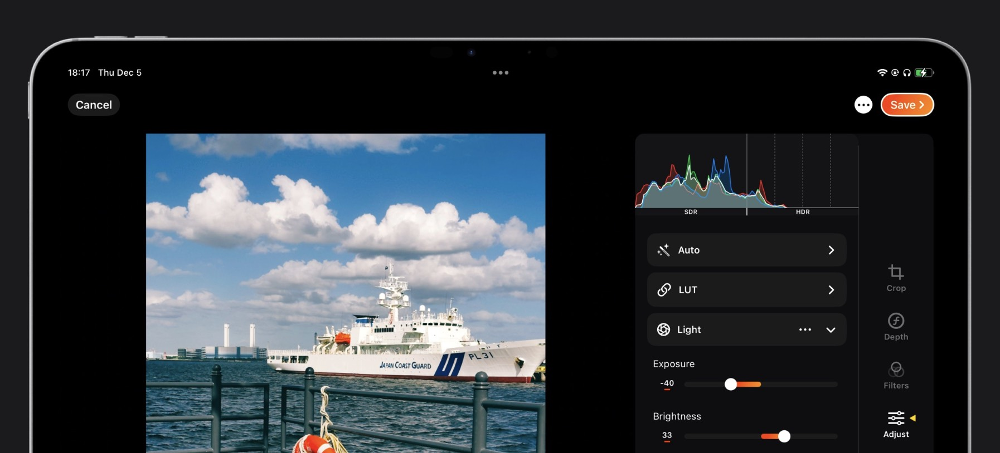
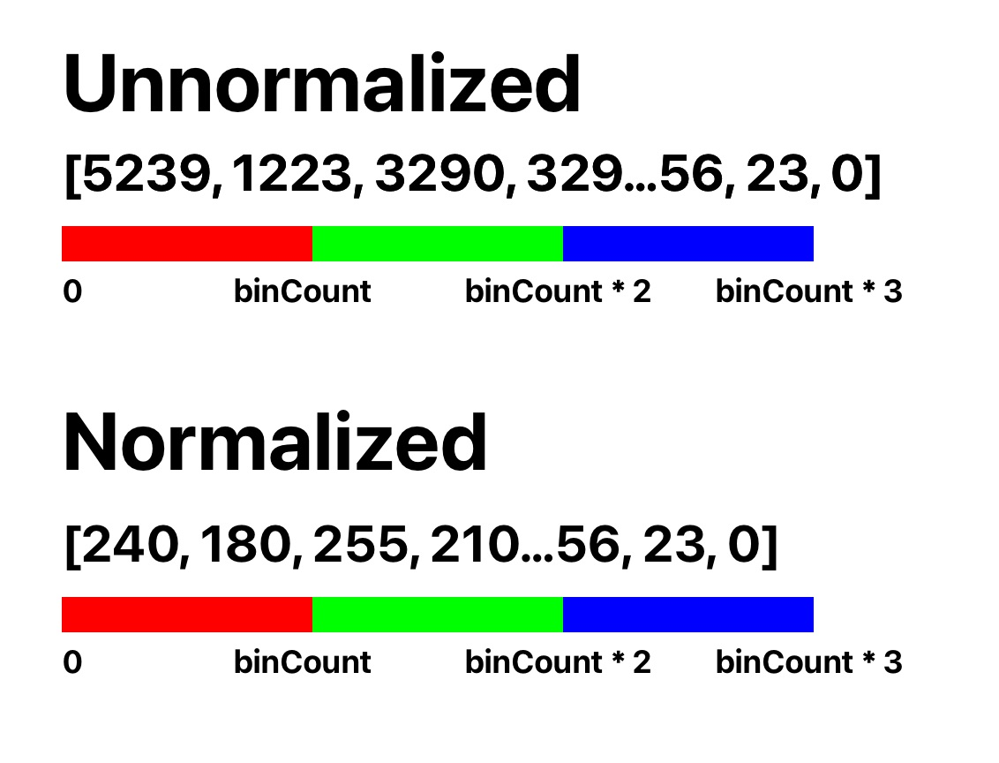
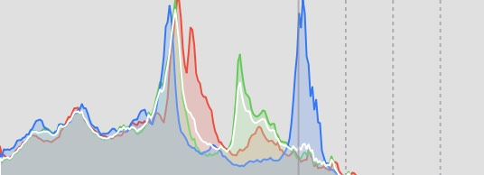

# PhotonHistogramKit

A Swift package to help you calculate the histogram of a `CIImage` using MPS (Metal Performance Shader) as well as display the result in a SwiftUI view. This library features:

1. Uses Metal Performance Shader to calculate the histogram information.
2. Supports HDR images, meaning that RGB values exceeding 1.0 can be calculated.
3. Provides a SwiftUI view to display the histogram graph. You can draw it on your implementation if you prefer.
4. It's intended to be used in a real-time video / photo processing scenario with high performance.

> Aside from this documentation, you can also view the Swift DocC via Xcode -> Product -> Build Documentation.

This library is used in production in my Pro Camera & Photo Editor app: [PhotonCam](https://juniperphoton.dev/photoncam/).



# Histogram Calculation

## Basic usage

To calculate the histogram info of a `CIImage`:

1. Create an instance of `HistogramCalculator`.
2. Call the `calculateHistogramInfo(ciImage:targetColorSpace:maxHeadroom:binCount:maxSizeInPixel:)` method. The result will contain the `HistogramInfo` and the total pixel count after being resized if needed.
3. Use the `splitNormalized(histogramArray:binCount:pixelCount:)` method to get the per-channel info.

Sample code:

```swift
// Create and cache the calculator.
let calculator = HistogramCalculator()

// Calculate the histogram info.
let (histogramInfo, pixelCount) = try await calculator.calculateHistogramInfo(ciImage: ciImage)

// Split the histogram info into red, green, and blue channels.
let (red, green, blue) = try calculator.split(histogramArray: histogramInfo, pixelCount: pixelCount)
```

The histogramInfo instance is a type of `HistogramInfo`, which is a typealias of `[UInt32]`. It's the unnormalized version of the histogram info:



where:

1. The length of this array is `binCount * 3`.
2. The first `binCount` elements represents the count of pixels for each bin.

To normalize the histogram info, use the `splitNormalized(histogramArray:binCount:pixelCount:)` method, which will gives you the array containing elements ranging from `[0, 255]`.

> The normalization algorithm won't actually calculate the sum of all pixels in one bin range. Doing so will result in a small histogram view if most pixels of the image gather in some bins.

## Advanced usage

The `calculateHistogramInfo(ciImage:targetColorSpace:maxHeadroom:binCount:maxSizeInPixel:)` method gives you some controls of the calculation.

### Setting targetColorSpace

This is the target color space when rendering the `CIImage` to a metal texture. The default value will be extended Display P3 color space, where:

1. It's intended to use a non-linear color space, as our eyes interpret colors in a non-linear way.
2. If you are writing a unit test, it's best to set it to match the input image's color space, otherwise the histogram result won't be expected.
3. To support HDR images, it must be an extended color space, otherwise all pixels exceeding 1.0 values will be clampped to 1.0.

### HDR support

To calculate a HDR image, which contains pixel values that are greater than 1.0, you must pass the `maxHeadroom` parameter with value greater than 1.0. It's the headroom value in the linear space, representing the maximum value of a pixel.

You don't have to calculate the maximum pixel value of an image. Setting this a fixed value can help maintain the look of the histogram view. For example, if your app supports up to 4 stops of HDR, you can set the `maxHeadroom` to `pow(2, 4)`.

### Bin Count

By default, the bin count is `HistogramCalculator.defaultBinCount`, which is 256 currently. Decreasing the bin count can improve the performance.

### Scaling down the image

Setting the `maxSizeInPixel` parameter will scale down the image before rendering to a metal texture, which is crutial to achieve a high performance. The default value is 1000px.

# Display the histogram using SwiftUI

This library also comes with a SwiftUI view to help you display the histogram:



Sample code:

```swift
HistogramRenderView(
    redInfo: viewModel.redInfo,
    greenInfo: viewModel.greenInfo,
    blueInfo: viewModel.blueInfo,
    options: HistogramRenderView.Options(
        displayChannels: displayChannels,
        dynamicRange: dynamicRange,
        drawAuxiliary: drawAuxiliary,
        backgroundColor: backgroundColor
    )
).frame(width: 100, height: 50)
```

where:

1. The `redInfo`, `greenInfo` and `blueInfo` are of the normalized `HistogramInfo` type.
2. You can specify the display options, such as which channels should be drawn.

It internally uses SwiftUI's `Path` to draw the histogram.

> Note: you may tempted to use the `drawingGroup` to improve the performance, which will increase the memory footprint. In my real app, I find it perfectly well-performs back to iPhone 12 with iOS 17.

# MIT License

Copyright (c) 2025 JuniperPhoton

Permission is hereby granted, free of charge, to any person obtaining a copy
of this software and associated documentation files (the "Software"), to deal
in the Software without restriction, including without limitation the rights
to use, copy, modify, merge, publish, distribute, sublicense, and/or sell
copies of the Software, and to permit persons to whom the Software is
furnished to do so, subject to the following conditions:

The above copyright notice and this permission notice shall be included in all
copies or substantial portions of the Software.

THE SOFTWARE IS PROVIDED "AS IS", WITHOUT WARRANTY OF ANY KIND, EXPRESS OR
IMPLIED, INCLUDING BUT NOT LIMITED TO THE WARRANTIES OF MERCHANTABILITY,
FITNESS FOR A PARTICULAR PURPOSE AND NONINFRINGEMENT. IN NO EVENT SHALL THE
AUTHORS OR COPYRIGHT HOLDERS BE LIABLE FOR ANY CLAIM, DAMAGES OR OTHER
LIABILITY, WHETHER IN AN ACTION OF CONTRACT, TORT OR OTHERWISE, ARISING FROM,
OUT OF OR IN CONNECTION WITH THE SOFTWARE OR THE USE OR OTHER DEALINGS IN THE
SOFTWARE.